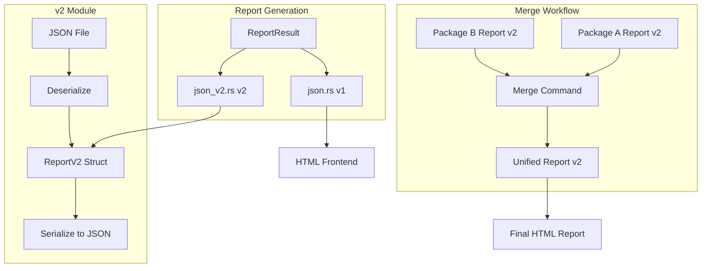
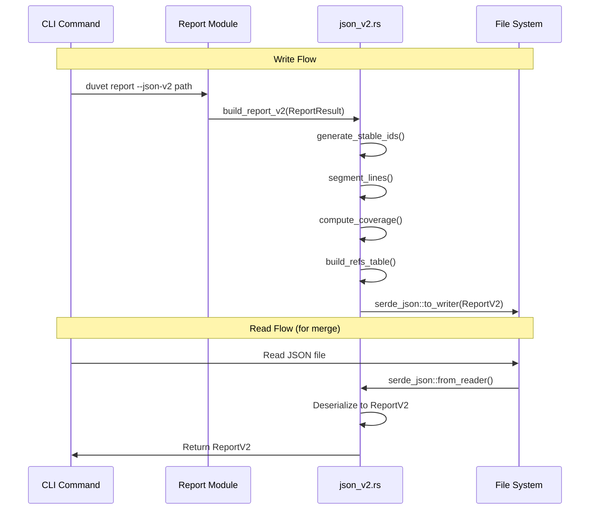

# Design Document: JSON v2 Format

## Overview

This feature implements a roundtrip-friendly JSON format (v2) for duvet reports. The current JSON format (`json.rs`) uses streaming macros optimized for the React frontend but cannot be deserialized. The v2 format uses serde derive for full read/write capability, enabling multi-package report merging. Key innovations include stable content-derived annotation IDs (FNV-1a hash), line segmentation for precise coverage tracking, and a self-contained format where annotations include their quote text for portability.

The v2 format coexists with v1—v1 remains for HTML frontend compatibility while v2 serves tooling and merge workflows.

## Architecture



## Main Algorithm/Workflow



## Components and Interfaces

### Component 1: ReportV2 Data Structures

**Purpose**: Define the v2 JSON schema as Rust structs with serde derive for bidirectional serialization.

**Interface**:
```rust
#[derive(Debug, Clone, Serialize, Deserialize, PartialEq)]
pub struct ReportV2 {
    pub version: String,  // "2.0"
    #[serde(skip_serializing_if = "Option::is_none")]
    pub blob_link: Option<String>,
    #[serde(skip_serializing_if = "Option::is_none")]
    pub issue_link: Option<String>,
    pub specifications: BTreeMap<String, SpecificationV2>,
    pub annotations: Vec<AnnotationV2>,
    pub coverage: BTreeMap<String, CoverageStatus>,
    pub refs: Vec<RefStatus>,
}

#[derive(Debug, Clone, Serialize, Deserialize, PartialEq)]
pub struct SpecificationV2 {
    #[serde(skip_serializing_if = "Option::is_none")]
    pub title: Option<String>,
    pub format: String,
    pub sections: Vec<SectionV2>,
}

#[derive(Debug, Clone, Serialize, Deserialize, PartialEq)]
pub struct SectionV2 {
    pub id: String,
    pub title: String,
    pub lines: Vec<LineV2>,
    #[serde(default, skip_serializing_if = "Vec::is_empty")]
    pub requirements: Vec<String>,
}

#[derive(Debug, Clone, Serialize, Deserialize, PartialEq)]
#[serde(untagged)]
pub enum LineV2 {
    Plain(String),
    Segmented(Vec<LineSegmentV2>),
}

#[derive(Debug, Clone, Serialize, Deserialize, PartialEq)]
pub struct LineSegmentV2 {
    pub annotation_ids: Vec<String>,
    pub status_id: usize,
    pub text: String,
}

#[derive(Debug, Clone, Serialize, Deserialize, PartialEq)]
pub struct AnnotationV2 {
    pub id: String,
    pub source: String,
    #[serde(skip_serializing_if = "Option::is_none")]
    pub blob_link: Option<String>,
    pub target_path: String,
    #[serde(skip_serializing_if = "Option::is_none")]
    pub target_section: Option<String>,
    pub quote: String,
    #[serde(rename = "type")]
    pub anno_type: AnnotationType,
    pub level: AnnotationLevel,
    #[serde(skip_serializing_if = "Option::is_none")]
    pub line: Option<usize>,
    #[serde(skip_serializing_if = "Option::is_none")]
    pub comment: Option<String>,
    #[serde(skip_serializing_if = "Option::is_none")]
    pub feature: Option<String>,
    #[serde(skip_serializing_if = "Option::is_none")]
    pub tracking_issue: Option<String>,
    #[serde(default, skip_serializing_if = "Vec::is_empty")]
    pub tags: Vec<String>,
}

#[derive(Debug, Clone, Serialize, Deserialize, PartialEq, Default)]
pub struct CoverageStatus {
    #[serde(default, skip_serializing_if = "is_zero")]
    pub spec: usize,
    #[serde(default, skip_serializing_if = "is_zero")]
    pub incomplete: usize,
    #[serde(default, skip_serializing_if = "is_zero")]
    pub citation: usize,
    #[serde(default, skip_serializing_if = "is_zero")]
    pub implication: usize,
    #[serde(default, skip_serializing_if = "is_zero")]
    pub test: usize,
    #[serde(default, skip_serializing_if = "is_zero")]
    pub exception: usize,
    #[serde(default, skip_serializing_if = "is_zero")]
    pub todo: usize,
    #[serde(default, skip_serializing_if = "Vec::is_empty")]
    pub related: Vec<String>,
}

#[derive(Debug, Clone, Serialize, Deserialize, PartialEq, Default)]
pub struct RefStatus {
    #[serde(default, skip_serializing_if = "std::ops::Not::not")]
    pub spec: bool,
    #[serde(default, skip_serializing_if = "std::ops::Not::not")]
    pub citation: bool,
    #[serde(default, skip_serializing_if = "std::ops::Not::not")]
    pub implication: bool,
    #[serde(default, skip_serializing_if = "std::ops::Not::not")]
    pub test: bool,
    #[serde(default, skip_serializing_if = "std::ops::Not::not")]
    pub exception: bool,
    #[serde(default, skip_serializing_if = "std::ops::Not::not")]
    pub todo: bool,
    #[serde(default, skip_serializing_if = "AnnotationLevel::is_auto")]
    pub level: AnnotationLevel,
}
```

**Responsibilities**:
- Represent the complete v2 JSON schema
- Support bidirectional serialization via serde
- Use stable string IDs instead of ephemeral integers

### Component 2: Report Builder

**Purpose**: Convert internal `ReportResult` to `ReportV2` format.

**Interface**:
```rust
impl ReportV2 {
    /// Build a v2 report from the internal report result
    pub fn from_report_result(report: &ReportResult) -> Self;
}

/// Build stable annotation ID from content
pub fn stable_annotation_id(annotation: &Annotation) -> String;

/// Segment a line based on annotation coverage boundaries
fn segment_line(
    line: &Slice,
    references: &[&Reference],
    stable_id_map: &HashMap<usize, String>,
    refs_builder: &mut RefsTableBuilder,
) -> LineV2;
```

**Responsibilities**:
- Transform `ReportResult` into `ReportV2`
- Generate stable content-derived annotation IDs
- Segment lines at annotation boundaries
- Build the refs lookup table
- Compute coverage statistics with stable IDs

### Component 3: JSON I/O

**Purpose**: Read and write v2 JSON files.

**Interface**:
```rust
/// Write v2 report to file
pub fn write_report_v2(report: &ReportV2, path: &Path) -> Result<()>;

/// Read v2 report from file
pub fn read_report_v2(path: &Path) -> Result<ReportV2>;

/// Write v2 report to writer
pub fn write_report_v2_to_writer<W: Write>(report: &ReportV2, writer: W) -> Result<()>;

/// Read v2 report from reader
pub fn read_report_v2_from_reader<R: Read>(reader: R) -> Result<ReportV2>;
```

**Responsibilities**:
- Serialize `ReportV2` to JSON with proper formatting
- Deserialize JSON to `ReportV2`
- Handle file I/O errors gracefully

### Component 4: CLI Integration

**Purpose**: Add `--json-v2` flag to the report command.

**Interface**:
```rust
#[derive(Debug, Parser)]
pub struct Report {
    // ... existing fields ...
    
    /// Output report in v2 JSON format (roundtrip-friendly)
    #[clap(long)]
    json_v2: Option<Path>,
}
```

**Responsibilities**:
- Parse `--json-v2` CLI argument
- Trigger v2 report generation when flag is present
- Write v2 report to specified path

## Data Models

### Model 1: Stable Annotation ID

The stable ID is a 16-character hex string derived from FNV-1a 64-bit hash of:
- `source_path` (file path of annotation)
- `anno_line` (line number in source)
- `target_path` (specification URL or path)

```rust
// Composite key format: "{source_path}\0{anno_line}\0{target_path}"
// Example: "src/lib.rs\042\0https://www.rfc-editor.org/rfc/rfc9000#section-2.1"
// Result: "a3f7b2c1e9d04856"
```

**Validation Rules**:
- ID must be exactly 16 lowercase hex characters
- ID must be deterministic (same input → same output)
- ID must be unique within a report (collision-resistant)

### Model 2: Line Segmentation

Lines are segmented at annotation coverage boundaries. Each segment knows which annotations cover it.

```
Original line: "A server MUST accept both GET and POST requests."

Annotations:
- A (SPEC): covers entire line [0..48]
- B (Citation): covers "MUST accept both GET" [9..29]
- C (Test): covers "accept both GET and POST" [14..38]

Boundaries: 0, 9, 14, 29, 38, 48

Segments:
[0..9]   "A server " → [A]
[9..14]  "MUST "     → [A, B]
[14..29] "accept both GET" → [A, B, C]
[29..38] " and POST" → [A, C]
[38..48] " requests." → [A]
```

**Validation Rules**:
- Segments must cover the entire line without gaps
- Segment boundaries must be sorted ascending
- Each segment must have at least one annotation ID (if segmented)
- Plain lines (no annotations) use `LineV2::Plain(String)`

### Model 3: Refs Table

The refs table is a lookup array for reference status combinations. Each unique combination of flags gets an index.

```rust
// refs[0] = {} (empty - no coverage)
// refs[1] = { spec: true }
// refs[2] = { citation: true }
// refs[3] = { spec: true, citation: true }
// ...
```

**Validation Rules**:
- Index 0 should be empty status (no flags set)
- Each unique status combination appears exactly once
- `status_id` in segments must be valid index into refs array

## Key Functions with Formal Specifications

### Function 1: stable_annotation_id()

```rust
pub fn stable_annotation_id(annotation: &Annotation) -> String
```

**Preconditions:**
- `annotation` is a valid Annotation struct
- `annotation.source` is a valid path
- `annotation.anno_line` is a non-negative integer

**Postconditions:**
- Returns a 16-character lowercase hex string
- Same annotation always produces same ID (deterministic)
- Different annotations produce different IDs (with high probability)

**Loop Invariants:** N/A

### Function 2: segment_line()

```rust
fn segment_line(
    line: &Slice,
    references: &[&Reference],
    stable_id_map: &HashMap<usize, String>,
    refs_builder: &mut RefsTableBuilder,
) -> LineV2
```

**Preconditions:**
- `line` is a valid text slice
- `references` contains only references that overlap with this line
- `stable_id_map` maps all referenced annotation IDs to stable string IDs
- `refs_builder` is initialized

**Postconditions:**
- If no references, returns `LineV2::Plain(line.to_string())`
- If references exist, returns `LineV2::Segmented(segments)`
- Segments cover entire line without gaps or overlaps
- Each segment's `annotation_ids` contains stable IDs of covering annotations
- Each segment's `status_id` is valid index in refs table

**Loop Invariants:**
- Current position never exceeds line length
- All processed segments are contiguous

### Function 3: from_report_result()

```rust
impl ReportV2 {
    pub fn from_report_result(report: &ReportResult) -> Self
}
```

**Preconditions:**
- `report` is a valid ReportResult with populated targets and annotations
- All annotations have been processed and references resolved

**Postconditions:**
- Returns valid ReportV2 with version "2.0"
- All annotations have stable IDs
- All specifications are converted with segmented lines
- Coverage map uses stable IDs as keys
- Refs table contains all unique status combinations

**Loop Invariants:**
- All processed annotations have unique stable IDs
- All processed specifications maintain section order

### Function 4: write_report_v2() / read_report_v2()

```rust
pub fn write_report_v2(report: &ReportV2, path: &Path) -> Result<()>
pub fn read_report_v2(path: &Path) -> Result<ReportV2>
```

**Preconditions (write):**
- `report` is a valid ReportV2
- `path` is a writable file path

**Preconditions (read):**
- `path` exists and is readable
- File contains valid v2 JSON

**Postconditions (write):**
- File at `path` contains valid JSON representation of report
- JSON is formatted with indentation for readability

**Postconditions (read):**
- Returns ReportV2 equivalent to what was written
- All fields are properly deserialized

**Loop Invariants:** N/A

## Algorithmic Pseudocode

### Main Report Building Algorithm

```pascal
ALGORITHM build_report_v2(report_result)
INPUT: report_result of type ReportResult
OUTPUT: report_v2 of type ReportV2

BEGIN
  // Step 1: Build stable ID mapping for all annotations
  stable_id_map ← empty HashMap<usize, String>
  FOR each annotation IN report_result.annotations DO
    stable_id ← compute_fnv1a_hash(annotation.source, annotation.anno_line, annotation.target_path)
    stable_id_map.insert(annotation.id, stable_id)
  END FOR
  
  // Step 2: Convert annotations to v2 format
  annotations_v2 ← empty Vec<AnnotationV2>
  FOR each annotation IN report_result.annotations DO
    anno_v2 ← AnnotationV2 {
      id: stable_id_map[annotation.id],
      source: annotation.source,
      blob_link: annotation.blob_link,
      target_path: annotation.target_path,
      target_section: annotation.target_section,
      quote: annotation.quote,
      anno_type: annotation.anno,
      level: annotation.level,
      line: annotation.anno_line,
      comment: annotation.comment,
      feature: annotation.feature,
      tracking_issue: annotation.tracking_issue,
      tags: annotation.tags
    }
    annotations_v2.push(anno_v2)
  END FOR
  
  // Step 3: Build specifications with segmented lines
  refs_builder ← new RefsTableBuilder()
  specifications_v2 ← empty BTreeMap<String, SpecificationV2>
  
  FOR each (target, target_report) IN report_result.targets DO
    spec_v2 ← build_specification_v2(target_report, stable_id_map, refs_builder)
    specifications_v2.insert(target.path, spec_v2)
  END FOR
  
  // Step 4: Build coverage map with stable IDs
  coverage ← empty BTreeMap<String, CoverageStatus>
  FOR each (target, target_report) IN report_result.targets DO
    FOR each (anno_id, status) IN target_report.statuses DO
      stable_id ← stable_id_map[anno_id]
      coverage_status ← CoverageStatus {
        spec: status.spec,
        incomplete: status.incomplete,
        citation: status.citation,
        implication: status.implication,
        test: status.test,
        exception: status.exception,
        todo: status.todo,
        related: status.related.map(|id| stable_id_map[id])
      }
      coverage.insert(stable_id, coverage_status)
    END FOR
  END FOR
  
  // Step 5: Finalize refs table
  refs ← refs_builder.build()
  
  RETURN ReportV2 {
    version: "2.0",
    blob_link: report_result.blob_link,
    issue_link: report_result.issue_link,
    specifications: specifications_v2,
    annotations: annotations_v2,
    coverage: coverage,
    refs: refs
  }
END
```

**Preconditions:**
- report_result contains valid targets and annotations
- All references have been resolved

**Postconditions:**
- Returned ReportV2 is complete and valid
- All IDs are stable strings
- All lines are properly segmented

**Loop Invariants:**
- stable_id_map contains entries for all processed annotations
- All processed specifications maintain internal consistency

### Line Segmentation Algorithm

```pascal
ALGORITHM segment_line(line, references, stable_id_map, refs_builder)
INPUT: line of type Slice, references of type [Reference], stable_id_map, refs_builder
OUTPUT: line_v2 of type LineV2

BEGIN
  IF references IS EMPTY THEN
    RETURN LineV2::Plain(line.to_string())
  END IF
  
  // Collect all boundary points
  boundaries ← SortedSet<usize>
  boundaries.insert(0)
  boundaries.insert(line.length)
  
  FOR each ref IN references DO
    // Clamp to line bounds
    start ← max(ref.start - line.offset, 0)
    end ← min(ref.end - line.offset, line.length)
    boundaries.insert(start)
    boundaries.insert(end)
  END FOR
  
  // Build segments between consecutive boundaries
  segments ← empty Vec<LineSegmentV2>
  boundary_list ← boundaries.to_sorted_vec()
  
  FOR i FROM 0 TO boundary_list.length - 2 DO
    ASSERT i < boundary_list.length - 1
    
    seg_start ← boundary_list[i]
    seg_end ← boundary_list[i + 1]
    
    IF seg_start = seg_end THEN
      CONTINUE  // Skip zero-length segments
    END IF
    
    // Find annotations covering this segment
    covering_ids ← empty Vec<String>
    ref_status ← RefStatus::default()
    
    FOR each ref IN references DO
      ref_start ← max(ref.start - line.offset, 0)
      ref_end ← min(ref.end - line.offset, line.length)
      
      IF ref_start <= seg_start AND seg_end <= ref_end THEN
        stable_id ← stable_id_map[ref.annotation.id]
        covering_ids.push(stable_id)
        ref_status.apply(ref.annotation)
      END IF
    END FOR
    
    status_id ← refs_builder.get_or_insert(ref_status)
    text ← line.substring(seg_start, seg_end)
    
    segments.push(LineSegmentV2 {
      annotation_ids: covering_ids,
      status_id: status_id,
      text: text
    })
  END FOR
  
  RETURN LineV2::Segmented(segments)
END
```

**Preconditions:**
- line is a valid text slice
- references only contain refs overlapping this line
- stable_id_map has entries for all referenced annotations

**Postconditions:**
- Segments cover entire line without gaps
- Each segment has correct annotation coverage
- status_id is valid index into refs table

**Loop Invariants:**
- seg_start < seg_end for all processed segments
- All boundary points are within [0, line.length]

## Example Usage

```rust
use duvet::report::json_v2::{ReportV2, read_report_v2, write_report_v2};

// Writing a v2 report
let report_result = generate_report(&project).await?;
let report_v2 = ReportV2::from_report_result(&report_result);
write_report_v2(&report_v2, &Path::from("report.json"))?;

// Reading a v2 report (for merge)
let report_v2 = read_report_v2(&Path::from("package-a-report.json"))?;
assert_eq!(report_v2.version, "2.0");

// Accessing annotations by stable ID
for annotation in &report_v2.annotations {
    println!("Annotation {}: {} -> {}", 
        annotation.id, 
        annotation.source, 
        annotation.target_path);
}

// Checking coverage by stable ID
if let Some(coverage) = report_v2.coverage.get("a3f7b2c1e9d04856") {
    println!("Coverage: {}/{} bytes complete", 
        coverage.spec - coverage.incomplete, 
        coverage.spec);
}
```

## Correctness Properties

*A property is a characteristic or behavior that should hold true across all valid executions of a system—essentially, a formal statement about what the system should do. Properties serve as the bridge between human-readable specifications and machine-verifiable correctness guarantees.*

### Property 1: Serialization Round Trip

*For any* valid `ReportV2` instance, serializing to JSON and deserializing back produces an equivalent `ReportV2`.

**Validates: Requirements 1.1, 1.2, 1.3, 1.4, 1.5, 1.6, 1.7, 1.8, 7.2**

### Property 2: Stable ID Format

*For any* annotation, the stable ID produced by `stable_annotation_id()` is exactly 16 lowercase hexadecimal characters.

**Validates: Requirements 2.2**

### Property 3: Stable ID Determinism

*For any* annotation, calling `stable_annotation_id()` multiple times always produces the same result.

**Validates: Requirements 2.3**

### Property 4: Stable ID Uniqueness

*For any* two annotations with different (source_path, anno_line, target_path) tuples, their stable IDs are different.

**Validates: Requirements 2.4**

### Property 5: Line Segmentation Completeness

*For any* line and set of references, the concatenation of all segment texts equals the original line text.

**Validates: Requirements 3.4**

### Property 6: Line Segmentation Coverage Accuracy

*For any* line segment, the `annotation_ids` field contains exactly the stable IDs of annotations whose coverage range includes that segment's byte range.

**Validates: Requirements 3.5**

### Property 7: Status ID Validity

*For any* `LineSegmentV2` in a `ReportV2`, the `status_id` is a valid index into the `refs` array.

**Validates: Requirements 3.6, 4.4**

### Property 8: Refs Table Uniqueness

*For any* `ReportV2`, the `refs` array contains no duplicate `RefStatus` entries.

**Validates: Requirements 4.1, 6.5**

### Property 9: Coverage Map Completeness

*For any* annotation of type SPEC in a `ReportV2`, there exists a corresponding entry in the `coverage` map keyed by that annotation's stable ID.

**Validates: Requirements 5.2**

### Property 10: Version Field Correctness

*For any* `ReportV2` produced by `from_report_result()`, the `version` field equals "2.0".

**Validates: Requirements 6.1**

## Error Handling

### Error Scenario 1: Invalid JSON on Read

**Condition**: JSON file contains malformed JSON or doesn't match v2 schema
**Response**: Return `Error` with descriptive message including file path and parse error details
**Recovery**: Caller handles error, may prompt user to check file format

### Error Scenario 2: File I/O Failure

**Condition**: Cannot read from or write to specified path
**Response**: Return `Error` with I/O error details and path
**Recovery**: Caller handles error, may retry or prompt user

### Error Scenario 3: Version Mismatch on Read

**Condition**: JSON has `version` field that is not "2.0"
**Response**: Return `Error` indicating unsupported version
**Recovery**: Caller may attempt different parser or reject file

### Error Scenario 4: Missing Required Fields

**Condition**: Deserialized JSON missing required fields (version, specifications, annotations, coverage, refs)
**Response**: Serde returns deserialization error with field name
**Recovery**: Caller handles error, reports which field is missing

## Testing Strategy

### Unit Testing Approach

- Test `stable_annotation_id()` with known inputs and expected outputs
- Test `segment_line()` with various annotation overlap scenarios
- Test serde serialization/deserialization for each struct type
- Test edge cases: empty annotations, empty lines, single-character segments

### Property-Based Testing Approach

Property-based tests validate universal correctness across generated inputs.

**Property Test Configuration**:
- Minimum 100 iterations per property test
- Each property test tagged with: **Feature: json-v2-format, Property {number}: {property_text}**
- Property tests validate universal correctness across generated inputs

**Property Test Library**: `bolero` (already used in the codebase for property testing)

**Key Properties to Test**:
1. Round-trip serialization preserves all data
2. Stable IDs are deterministic
3. Line segmentation is complete and accurate
4. Refs table indices are always valid

### Integration Testing Approach

- Add integration test config that generates v2 JSON output
- Snapshot test the v2 JSON output structure
- Test reading back generated v2 JSON files
- Test with real RFC specifications to ensure compatibility

## Performance Considerations

- Use `BTreeMap` for deterministic key ordering in JSON output
- Build refs table incrementally to avoid duplicate status combinations
- Use buffered I/O for file operations
- Consider streaming for very large reports (future optimization)

## Security Considerations

- Validate file paths before I/O operations
- No execution of external code from JSON content
- FNV-1a hash is not cryptographic but sufficient for ID generation (collision resistance, not security)

## Dependencies

- `serde` and `serde_json` for serialization (already in project)
- `clap` for CLI argument parsing (already in project)
- Existing `duvet-core` types and utilities
- Existing `annotation.rs` for `stable_annotation_id()` function (already implemented)
